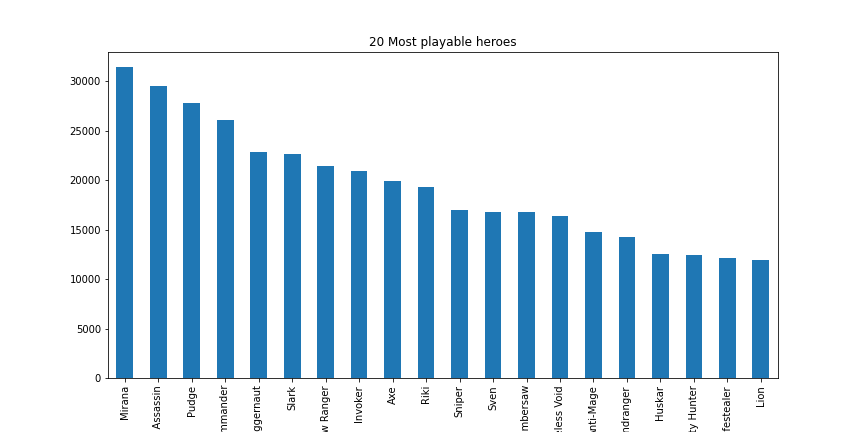
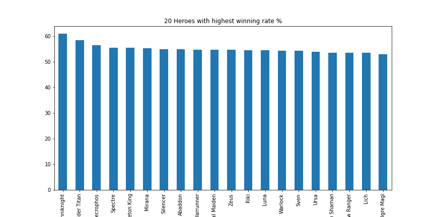
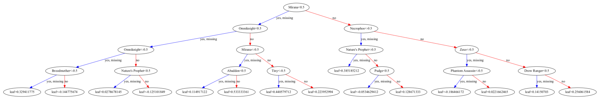
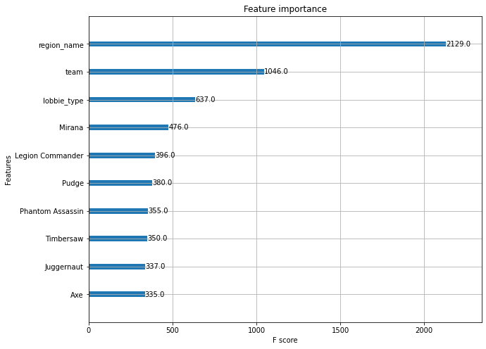

# Dota 2 Project

### Table of Contents

- [Description](#description)
- [Overview](#overview)
- [Dataset info](#dataset-info)
- [Software implementation](#software-implementation)
- [Getting the code](#getting-the-code)
- [Examples](#examples)
- [Authors](#authors)
- [License](#license)

---

## Description

Exploratory and Predictive analysis of the dataset  
 - Defined heroes with highest pick and wining rates
 - Identified some heroes combinations with the highest winning probability
 - Built ML models for predicting a winning team and game mode

---

## Overview

Dota 2 is a popular computer game with two teams of 5 players. At the start of the game each player chooses a unique hero with different strengths and weaknesses. The dataset is reasonably sparse as only 10 of 113 possible heroes are chosen in a given game. All games were played in a space of 2 hours on the 13th of August, 2016

---

## Dataset info

Each row of the dataset is a single game with the following features (in the order in the vector):
1. Team won the game (1 or -1)
2. Cluster ID (related to location)
3. Game mode (eg All Pick)
4. Game type (eg. Ranked)
5. *till end*: Each element is an indicator for a hero.   
    Value of 1 indicates that a player from team '1' played as that hero and '-1' for the other team.    
    Hero can be selected by only one player each game. This means that each row has five '1' and five '-1' values.

---

## Software implementation

All source code used to generate the results and figures in the paper are in the `dota2.ipynb`.
The calculations and figure generation are all run inside
[Jupyter notebooks](http://jupyter.org/).
The data used in this study is provided in `dataset` folder 
and was taken from [here](https://archive.ics.uci.edu/ml/datasets/Dota2+Games+Results).

---

## Getting the code

You can download a copy of all the files in this repository by cloning the git repository:

    git clone https://github.com/DthRazak/Dota2Project.git

or [download a zip archive](https://github.com/DthRazak/Dota2Project/archive/refs/heads/master.zip).

---

## Examples

### Hero pick analysis

### Winning rate calculation 

Hero | WINS | LOSES | WIN RATE
--- |--- | --- | --- 
Anti-Mage | 6859 | 7858| 46.61
Axe	| 10476 | 9375 | 52.77
Bane | 1119 | 1369 | 44.98
Bloodseeker | 5860 | 5674 | 50.81
Crystal Maiden | 5428 | 4492 | 54.72
... | ... | ... | ...
Terrorblade | 2167 | 2269 | 48.85
Phoenix | 1939 | 1838 | 51.34
Oracle	| 1120 | 1468 | 43.28
Winter Wyvern | 1465 | 1808 | 44.76
Arc Warden | 768 | 1001 | 43.41
112 rows × 3 columns

### Mode Name Prediction (XGBoost Model)

### Feature importance

---

## Authors

- [Volodymyr Milchanovskyi](https://github.com/DthRazak)
- [Viktor Seredovych](https://github.com/vseredovych)

---

## License

This project is licensed with the .